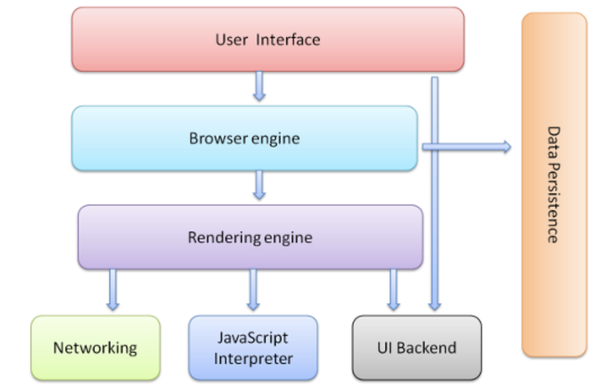

## 浏览器

1. 浏览器结构
2. 浏览器渲染过程
3. 处理脚本和样式表的顺序
4. 布局
5. 绘制
6. 布局绘制总结
7. 同源策略和跨域
8. 解析概述 TODO
   1. JavaScript解析
   2. HTML解析
   3. CSS解析
---


### 浏览器结构

1. 用户界面 - 包括地址栏、前进/后退按钮、书签菜单等。除了浏览器主窗口显示的您请求的页面外，其他显示的各个部分都属于用户界面。
2. 浏览器引擎 - 在用户界面和渲染引擎之间传送指令。
3. 渲染引擎(浏览器内核) - 负责显示请求的内容。如果请求的内容是 HTML，它就负责解析 HTML 和 CSS 内容，并将解析后的内容显示在屏幕上。
4. 网络 - 用于网络调用，比如 HTTP 请求。其接口与平台无关，并为所有平台提供底层实现。
5. 用户界面后端 - 用于绘制基本的窗口小部件，比如组合框和窗口。其公开了与平台无关的通用接口，而在底层使用操作系统的用户界面方法。
6. JavaScript 解释器。用于解析和执行 JavaScript 代码。
7. 数据存储。这是持久层。浏览器需要在硬盘上保存各种数据，例如 Cookie。新的 HTML 规范 (HTML5) 定义了“网络数据库”，这是一个完整（但是轻便）的浏览器内数据库。
> Chrome 浏览器的每个标签页都分别对应一个渲染引擎实例。每个标签页都是一个独立的进程。




### 浏览器渲染过程

1. 浏览器内核一开始会从网络层获取请求文档的内容
2. 将开始解析 HTML 文档，并将各标记逐个转化成“content tree”上的 DOM 节点。同时也会解析外部 CSS 文件以及样式元素中的样式数据。HTML 中这些带有视觉指令的样式信息将用于创建另一个树结构：render tree。
3. render tree 包含多个带有视觉属性（如颜色和尺寸）的矩形。这些矩形的排列顺序就是它们将在屏幕上显示的顺序。
4. render tree 构建完毕之后，进入“布局”处理阶段，也就是为每个节点分配一个应出现在屏幕上的确切坐标。下一个阶段是绘制 - 渲染引擎会遍历render tree，由用户界面后端层将每个节点绘制出来.
   
> 需要着重指出的是，这是一个渐进的过程。为达到更好的用户体验，渲染引擎会力求尽快将内容显示在屏幕上。它不必等到整个 HTML 文档解析完毕之后，就会开始构建render tree和设置布局。在不断接收和处理来自网络的其余内容的同时，渲染引擎会将部分内容解析并显示出来。


* webkit内核主流程
  

* Gecko内核主流程
  

* 虽然 WebKit 和 Gecko 使用的术语略有不同，但整体流程是基本相同的。

### 处理脚本和样式表的顺序
* Scripts
  * 网络的模型是同步的。网页作者希望解析器遇到 `<script>`标记时立即解析并执行脚本。文档的解析将停止，直到脚本执行完毕。如果脚本是外部的，那么解析过程会停止，直到从网络同步抓取资源完成后再继续。此模型已经使用了多年，也在 HTML4 和 HTML5 规范中进行了指定。作者也可以将脚本标注为“defer”，这样它就不会停止文档解析，而是等到解析结束才执行。HTML5 增加了一个选项，可将脚本标记为异步，以便由其他线程解析和执行。
  
* 预解析
   * WebKit 和 Firefox 都进行了这项优化。在执行脚本时，其他线程会解析文档的其余部分，找出并加载需要通过网络加载的其他资源。通过这种方式，资源可以在并行连接上加载，从而提高总体速度。请注意，预解析器不会修改 DOM 树，而是将这项工作交由主解析器处理；预解析器只会解析外部资源（例如外部脚本、样式表和图片）的引用。

* 样式表
  * 理论上来说，应用样式表不会更改 DOM 树，因此似乎没有必要等待样式表并停止文档解析。但这涉及到一个问题，就是脚本在文档解析阶段会请求样式信息。如果当时还没有加载和解析样式，脚本就会获得错误的回复，这样显然会产生很多问题。这看上去是一个非典型案例，但事实上非常普遍。Firefox 在样式表加载和解析的过程中，会禁止所有脚本。而对于 WebKit 而言，仅当脚本尝试访问的样式属性可能受尚未加载的样式表影响时，它才会禁止该脚本。

* 渲染树构建
  * 在 DOM 树构建的同时，浏览器还会构建另一个树结构：渲染树(render tree)。这是由可视化元素按照其显示顺序而组成的树，也是文档的可视化表示。它的作用是让您按照正确的顺序绘制内容。Firefox 将渲染树中的元素称为“框架（frames）”。WebKit 使用的术语是渲染器（renderer）或渲染对象（render object）。渲染器知道如何布局并将自身及其子元素绘制出来。
  * 每一个渲染器都代表了一个矩形的区域，通常对应于相关节点的 CSS 框，这一点在 CSS2 规范中有所描述。它包含诸如宽度、高度和位置等几何信息。
  * WebKits RenderObject 类是所有渲染器的基类，其定义如下：
    ```c++
    class RenderObject{
      virtual void layout();
      virtual void paint(PaintInfo);
      virtual void rect repaintRect();
      Node* node;  //the DOM node
      RenderStyle* style;  // the computed style
      RenderLayer* containgLayer; //the containing z-index layer
    }
    ```

* 渲染树和 DOM 树的关系
  * 渲染器是和 DOM 元素相对应的，但并非一一对应。非可视化的 DOM 元素不会插入渲染树中，例如“head”元素。如果元素的 display 属性值为“none”，那么也不会显示在渲染树中（但是 visibility 属性值为“hidden”的元素仍会显示）。
  * 有一些 DOM 元素对应多个可视化对象。它们往往是具有复杂结构的元素，无法用单一的矩形来描述。例如，“select”元素有 3 个渲染器：一个用于显示区域，一个用于下拉列表框，还有一个用于按钮。如果由于宽度不够，文本无法在一行中显示而分为多行，那么新的行也会作为新的渲染器而添加。
  * 另一个关于多渲染器的例子是格式无效的 HTML。根据 CSS 规范，inline 元素只能包含 block 元素或 inline 元素中的一种。如果出现了混合内容，则应创建匿名的 block 渲染器，以包裹 inline 元素。
  * 有一些渲染对象对应于 DOM 节点，但在树中所在的位置与 DOM 节点不同。浮动定位和绝对定位的元素就是这样，它们处于正常的流程之外，放置在树中的其他地方，并映射到真正的框架，而放在原位的是占位框架。


### 布局
* 渲染器在创建完成并添加到渲染树时，并不包含位置和大小信息。计算这些值的过程称为布局或重排（reflow）。
* HTML 采用基于流的布局模型，这意味着大多数情况下只要一次遍历就能计算出几何信息。处于流中靠后位置元素通常不会影响靠前位置元素的几何特征，因此布局可以按从左至右、从上至下的顺序遍历文档。坐标系是相对于根框架而建立的，使用的是上坐标和左坐标。布局是一个递归的过程。它从根渲染器（对应于 HTML 文档的 `<html>` 元素）开始，然后递归遍历部分或所有的框架层次结构，为每一个需要计算的渲染器计算几何信息
* Dirty bit system
  * 为避免对所有细小更改都进行整体布局，浏览器采用了一种Dirty bit system。如果某个渲染器发生了更改，或者将自身及其子代标注为“dirty”，则需要进行布局。
  * 有两种标记：“dirty”和“children are dirty”。“children are dirty”表示尽管渲染器自身没有变化，但它至少有一个子代需要布局。
* 全局布局
  * 全局布局是指触发了整个渲染树范围的布局，触发原因可能包括
    * 影响所有渲染器的全局样式更改，例如字体大小更改。
    * 屏幕大小调整
  * 全局布局往往是同步触发的。
  
* 增量布局
  * 布局可以采用增量方式，也就是只对 dirty 渲染器进行布局（这样可能存在需要进行额外布局的弊端）。
  * 增量布局是异步执行的。
  * 请求样式信息（例如“offsetHeight”）的脚本可同步触发增量布局。

### 绘制
* 在绘制阶段，系统会遍历渲染树，并调用渲染器的“paint”方法，将渲染器的内容显示在屏幕上。绘制工作是使用用户界面基础组件完成的。
* 全局绘制和增量绘制
  * 和布局一样，绘制也分为全局（绘制整个渲染树）和增量两种。在增量绘制中，部分渲染器发生了更改，但是不会影响整个树。更改后的渲染器将其在屏幕上对应的矩形区域设为无效，这导致 OS 将其视为一块“dirty 区域”，并生成“paint”事件。OS 会很巧妙地将多个区域合并成一个。在 Chrome 浏览器中，情况要更复杂一些，因为 Chrome 浏览器的渲染器不在主进程上。Chrome 浏览器会在某种程度上模拟 OS 的行为。展示层会侦听这些事件，并将消息委托给渲染根节点。然后遍历渲染树，直到找到相关的渲染器，该渲染器会重新绘制自己（通常也包括其子代）。
  * 绘制顺序
    1. 背景颜色
    2. 背景图片
    3. 边框
    4. 子代
    5. 轮廓
  * 在发生变化时，浏览器会尽可能做出最小的响应。因此，元素的颜色改变后，只会对该元素进行重绘。元素的位置改变后，只会对该元素及其子元素（可能还有同级元素）进行布局和重绘。添加 DOM 节点后，会对该节点进行布局和重绘。一些重大变化（例如增大“html”元素的字体）会导致缓存无效，使得整个渲染树都会进行重新布局和绘制。
  * 渲染引擎采用了单线程。几乎所有操作（除了网络操作）都是在单线程中进行的。在 Firefox 和 Safari 中，该线程就是浏览器的主线程。而在 Chrome 浏览器中，该线程是标签进程的主线程。网络操作可由多个并行线程执行。并行连接数是有限的（通常为 2 至 6 个，以 Firefox 3 为例是 6 个）。

### `布局绘制总结`

* 先吐槽一下，reflow翻译成“重排”欠妥，丢失了原来的意义。重绘（repaint）找不到准确的出处，但chromium中有Repaint Functions。详见 [How repaint works](https://www.chromium.org/blink/how-repaint-works)

* 由浏览器的渲染过程可得：触发布局后一定会触发绘制，触发绘制则不一定触发布局。
* 触发布局的代码非常常见，改变元素大小内容或获取元素位置信息的都会触发布局。总的可以分为两类
  * 触发全局布局
    * 全局样式更改，如字体大小
    * 屏幕大小调整
  * 触发增量布局
    * 新增和删除可见元素
    * 元素位置和尺寸发生改变
    * 设置style属性
    * 激活CSS伪类
    * 请求样式信息（例如“offsetHeight，getComputedStyle”）的脚本
* 仅触发绘制
  * 颜色属性改变
  * visibility属性

* 优化措施
  * 集中改变样式
  * 缓存布局信息
  * 启用GPU加速
    * canvas2D
    * transitions
    * transforms
    * WebGL，video

### 同源策略和跨域
* 同源策略指三个相同
  * 协议相同
  * 域名相同
  * 端口相同
* 不受同源策略限制的
  * `<script src= >` 标签
  * `` 标签
  * `<a href= >` 标签
* 受同源策略限制的
  * Cookie、LocalStorage 和 IndexDB 无法读取
  * DOM 无法获得
  * AJAX 请求不能发送
  * canvas drawImage
  * WebGL贴图
  * @font-face字体
* 解决同源策略
  * CORS
    * 适用情况
      1. 由 XMLHttpRequest 或 Fetch 发起的跨域 HTTP 请求。
      2. Web 字体 (CSS 中通过 @font-face 使用跨域字体资源), 因此，网站就可以发布 TrueType 字体资源，并只允许已授3权网站进行跨站调用。
      3. WebGL 贴图
      4. 使用 drawImage 将 Images/video 画面绘制到 canvas
    * HTTP 响应首部字段
      1. `Access-Control-Allow-Origin`
      2. `Access-Control-Expose-Headers`
      3. Access-Control-Max-Age
      4. Access-Control-Allow-Credentials
      5. `Access-Control-Allow-Methods`
      6. Access-Control-Allow-Headers
  * jsonp
    * 适用情况
      1. 获取文本数据，如json，string等

---

## 参考资料
* https://www.html5rocks.com/zh/tutorials/internals/howbrowserswork/#Render_tree_construction
* https://developers.google.com/web/updates/2018/09/inside-browser-part1
* https://developer.mozilla.org/zh-CN/docs/Web/HTTP/Access_control_CORS